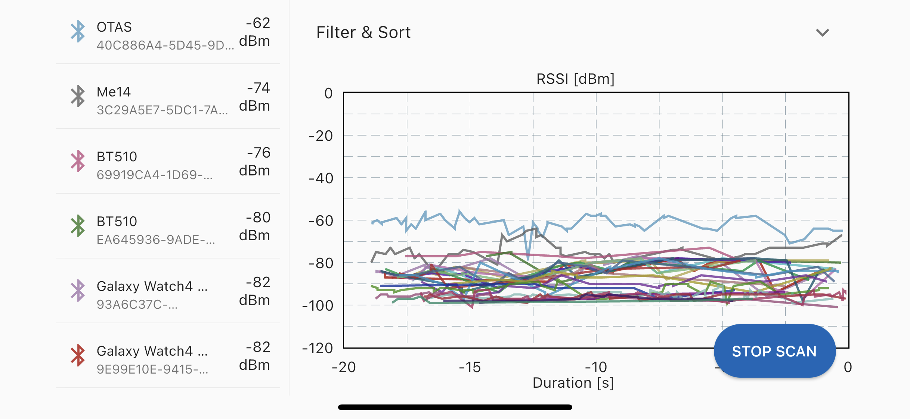
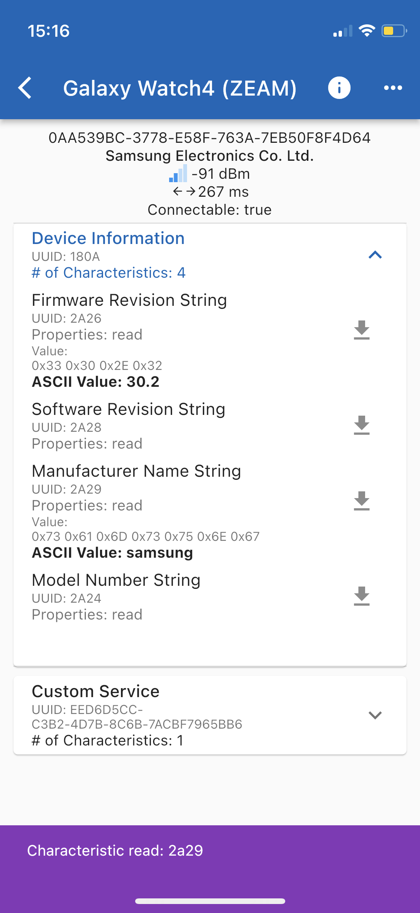
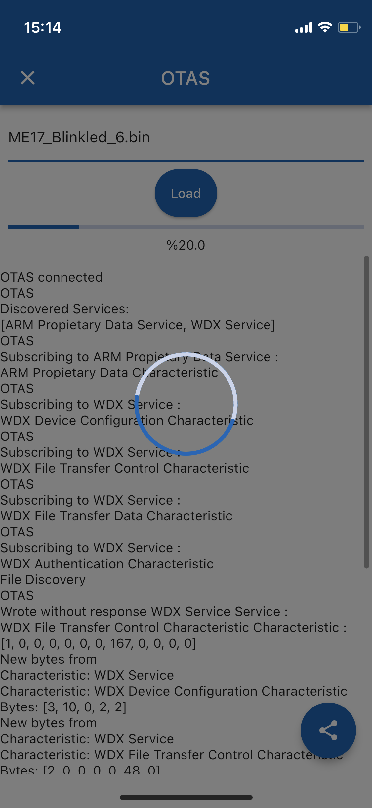

# ADI Attach

## Introduction

Cross-platform mobile application that manage Bluetooth Low Energy(BLE) devices. 

App can do:
- Scan Bluetooth Low Energy(BLE) Devices
- Connect to BLE Devices
- Discover Services and Characteristics of Connected Device
- Read, Write, Subscribe to Characteristic
- Upload Binary File With WDX Service
- View RSSI Graph

## Installation 

### Flutter:
- [Download Flutter](https://docs.flutter.dev/get-started/install)
- Setup your [IDE which you use(VS Code, Android Studio, IntelliJ, or Emacs)](https://docs.flutter.dev/get-started/editor)

### LVVM:
- Install LLVM:
    - Windows: `winget install -e --id LLVM.LLVM`
    - MacOs: `brew install llvm`
    - Ubuntu/Linux: `sudo apt-get install libclang-dev`

### Clone and Build Project:
- Clone the [project](https://github.com/Analog-Devices-MSDK/ADI_Attach): `git clone --recurse-submodules https://github.com/Analog-Devices-MSDK/ADI_Attach.git`
- Go to project folder: `cd ADI_Attach`
- Run: `flutter pub get`
- Run: `dart run ffigen`
- Run `flutter run`

## Feature

Discovered devices are displayed with information(name, mac address,rssi, company name) on the screen while scanning.

When turn the phone sideways while scanning, the rssi graph of the discovered devices is displayed.

When connected to the device, the device's services and characteristics are listed. Under the services, service characteristics are listed with names and which properties it support.

Perform the operations of Characteristics by pressing the icons next to them. An example characteristic operation; value that receive after the Device Name characteristic is read is seen under the characteristic' information.

With WDX Service, firmware can be sent to the device with a binary file. After selecting the file, pressing the load button starts the file sending process.

## Contributing
Contributions to the ADI Attach are welcome.  See [CONTRIBUTING.md](CONTRIBUTING.md) for guidelines.

## License

**© Copyright (C) 2022 Analog Devices, Inc., All rights Reserved.**

This software is protected by copyright laws of the United States and 
of foreign countries. This material may also be protected by patent laws 
and technology transfer regulations of the United States and of foreign 
countries. This software is furnished under a license agreement and/or a 
nondisclosure agreement and may only be used or reproduced in accordance 
with the terms of those agreements. Dissemination of this information to 
any party or parties not specified in the license agreement and/or 
nondisclosure agreement is expressly prohibited.

The above copyright notice and this permission notice shall be included 
in all copies or substantial portions of the Software.

THE SOFTWARE IS PROVIDED "AS IS", WITHOUT WARRANTY OF ANY KIND, EXPRESS 
OR IMPLIED, INCLUDING BUT NOT LIMITED TO THE WARRANTIES OF 
MERCHANTABILITY, FITNESS FOR A PARTICULAR PURPOSE AND NONINFRINGEMENT. 
IN NO EVENT SHALL MAXIM INTEGRATED BE LIABLE FOR ANY CLAIM, DAMAGES 
OR OTHER LIABILITY, WHETHER IN AN ACTION OF CONTRACT, TORT OR OTHERWISE, 
ARISING FROM, OUT OF OR IN CONNECTION WITH THE SOFTWARE OR THE USE OR 
OTHER DEALINGS IN THE SOFTWARE.

Except as contained in this notice, the name of Analog Devices, Inc. 
shall not be used except as stated in the Analog Devices, Inc. 
Branding Policy.

The mere transfer of this software does not imply any licenses 
of trade secrets, proprietary technology, copyrights, patents, 
trademarks, mask work rights, or any other form of intellectual 
property whatsoever. Analog Devices, Inc. retains all rights, 
title and interest in the software.

[Final Copyright](https://www.maximintegrated.com/en/aboutus/legal/copyrights/default-copyright.html "Final Copyright")
